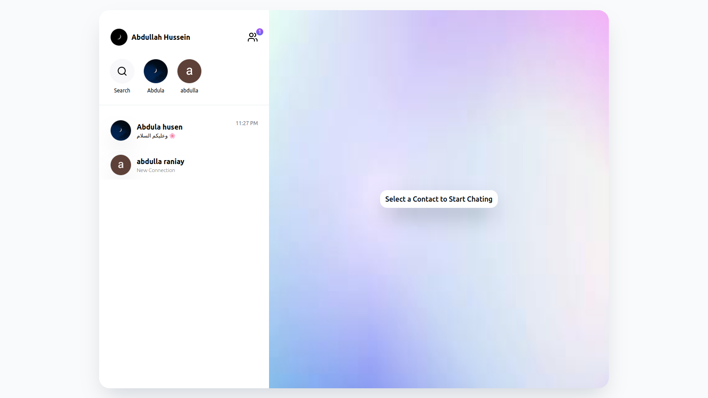
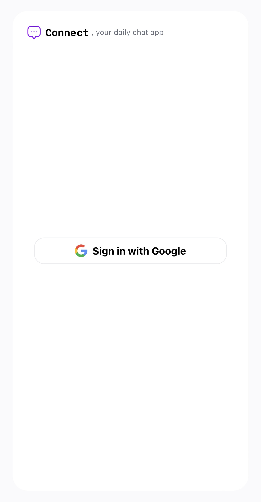

# Connect

Welcome to **Connect**, a modern chat application built with **React**, **Redux Toolkit**, **RTK Query**, **React Router**, **Firebase**, **Tailwind**, and **Vite**. This app allows users to send messages and manage connections (adding, accepting, rejecting, and undoing connections). It features a clean, responsive UI and real-time data powered by Firebase Firestore and Google Authentication.

<div align="center"></div>
<div align="center" style="display: flex;flex-wrap: no-wrap;justify-content: center; gap: 10px;">
    
    
    
</div>

## Features

- **Messaging**: Send and receive real-time messages.
- **Connection Management**: Add, accept, reject, and undo connection requests.
- **Real-time Data**: Leverage Firebase Firestore to stream updates in real-time.
- **Google Authentication**: Secure login using Google Authentication.
- **Responsive Design**: A modern, user-friendly, and mobile-first UI using Tailwind.
- **Vite**: Fast development experience with Vite for optimized build and dev server.

## Tech Stack

- **Frontend**: React (Hooks-based functional components)
- **State Management**: Redux Toolkit with RTK Query for API caching and streaming updates
- **Routing**: React Router for seamless navigation between app pages
- **Backend**: Firebase for authentication, Firestore for real-time database
- **UI**: Tailwind CSS for a modern and responsive design
- **Build Tool**: Vite for a fast development and optimized build process

## Installation

1. Clone the repository:
   ```bash
   git clone https://github.com/abdullahhussein1/connect.git
   cd connect
   ```

2. Install dependencies:
   ```bash
   npm install
   ```

3. Set up Firebase:
   - Go to the [Firebase Console](https://console.firebase.google.com/).
   - Create a new project and enable Firestore, Authentication (Google), and configure the Firebase SDK.
   - Add your Firebase configuration to a `.env` file in the root directory:
     ```
     VITE_FIREBASE_API_KEY=your_firebase_api_key
     VITE_FIREBASE_AUTH_DOMAIN=your_project_id.firebaseapp.com
     VITE_FIREBASE_PROJECT_ID=your_project_id
     VITE_FIREBASE_STORAGE_BUCKET=your_project_id.appspot.com
     VITE_FIREBASE_MESSAGING_SENDER_ID=your_messaging_sender_id
     VITE_FIREBASE_APP_ID=your_app_id
     ```

4. Start the app:
   ```bash
   npm run dev
   ```

5. The app will be available at `http://localhost:5173`.

## Usage

1. **Login with Google**: Use the Google Authentication system to sign in.
2. **Manage Connections**: Send connection requests, accept/reject incoming requests, and undo actions.
3. **Messaging**: Send real-time messages to your connections.

## Contributing

Contributions are welcome! If you'd like to contribute, please fork the repository, create a new branch, and submit a pull request.

## License

This project is licensed under the MIT License - see the [LICENSE](LICENSE) file for details.

---

Thank you for using **Connect**! Feel free to open issues or pull requests for any improvements or bug fixes.
